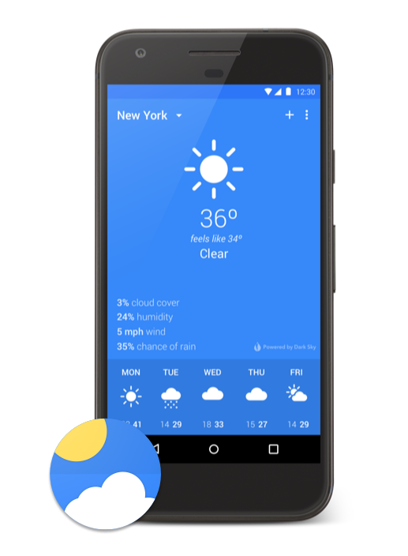
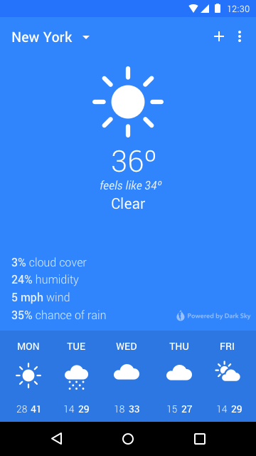
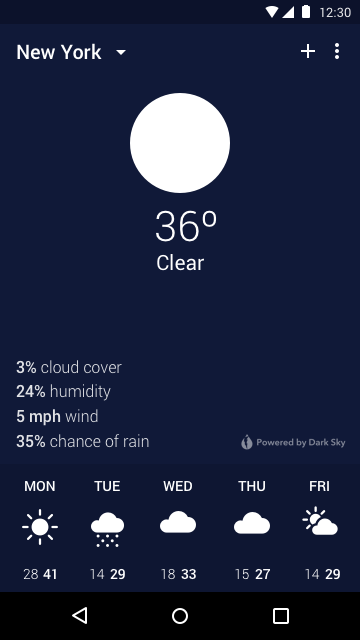
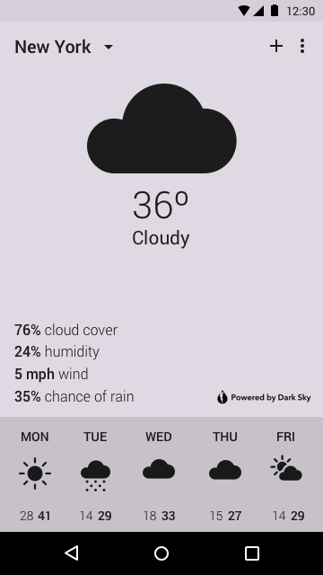
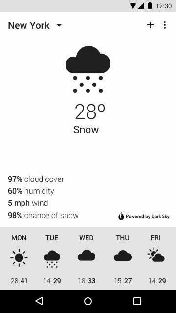

# Breeze



*Minimal weather app for Android.*

Breeze is a very simple weather app still under development. I currently do not have plans to release the app on the Play Store. Below a short roadmap of functionality that will be worked on next.

This project will provide an opportunity to experiment with new platform features and functionality in a product simple enough to iterate on.

Breeze runs on Android 4.4 and higher.

### Data Source API Keys

Prior to building and running the application, you'll need to obtain API keys from [Dark Sky](https://darksky.net/dev) and [Weather Underground](https://www.wunderground.com/weather/api).

Copy the keys.properties.example file to keys.properties:

        $ cp keys.properties.example keys.properties

Open the keys.properties file and enter your keys where the placeholders are. This will make the keys available through the BuildConfig class in Java.

### Features

* Simple overview of the current conditions.
* Brief outlook of the conditions and temperatures for the next few days.
* Color theme for night, cloudy, or snowy conditions.

### Limitations

* Currently only supports your current location.
* Does not provide any forecast details.
* Limited data shown for the current conditions.

### Roadmap

* Support a collection of saved locations.
* More details about the current conditions.
* Forecast view that will show the details for each day.
* Watches and warnings. 

### Screenshots






### License

```
Copyright 2017 Michael Novak

Licensed under the Apache License, Version 2.0 (the "License");
you may not use this file except in compliance with the License.
You may obtain a copy of the License at

   http://www.apache.org/licenses/LICENSE-2.0

Unless required by applicable law or agreed to in writing, software
distributed under the License is distributed on an "AS IS" BASIS,
WITHOUT WARRANTIES OR CONDITIONS OF ANY KIND, either express or implied.
See the License for the specific language governing permissions and
limitations under the License.
```

